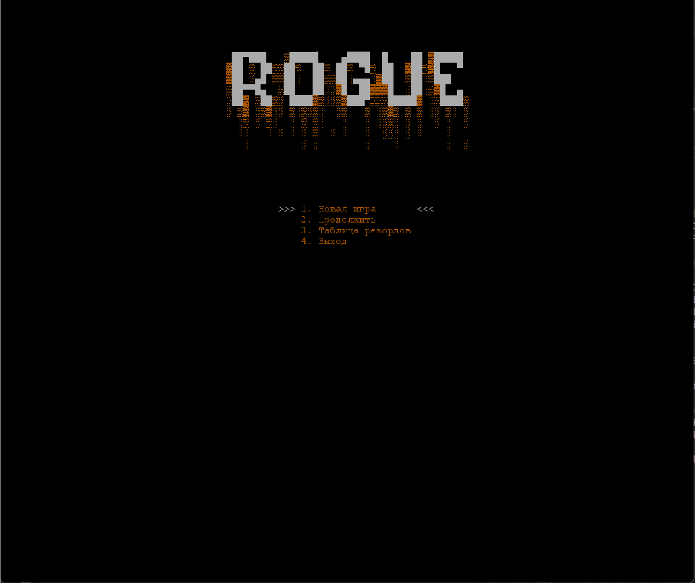

# 🎮 Rogue1980

**Rogue (1980) — классическая компьютерная игра в жанре roguelike, которая положила начало всему жанру. Разработана Майклом Тойом, Гленном Вичманом и Кеном Арнольдом для UNIX-систем.**

### ✨ Дополнительные возможности
- Система сохранений — продолжайте игру без потери прогресса (автосохранение по прохождению уровня)

## ⚙️ Технологии

**Фронтенд:**  

**Бэкенд:**  

**Данные:**  

## Управление:
- W / A / S / D - перемещение
- H - Использовать оружие
- J - Использовать еду
- K - Использовать эликсир
- E - Использовать свиток
- Q - Выход